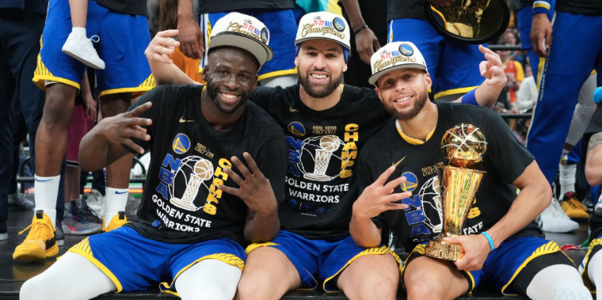

# Golden State Warriors
<!DOCTYPE html>
<html lang="pt-Br">

<head>
    <meta charset="UTF-8">
    <meta name="viewport" content="width=device-width, initial-scale=1.0">
    <link rel="stylesheet" href="styles.css">

    <title>Folhetim Mr.Felix</title>

</head>

<body>
    <header>
        <h1> A Disnatia do Golden State Warriors na NBA </h1>
        
 Nesta pagina irei explicar o que é e como foi a disnatia do Golden State Warriors na NBA

    </header>
    <main>
        <article>
            
            

                <h2>Meu primeiro post</h2>
                
Por: Autor

                
De boas vindas aos seus usuários

                <button>❤️ 0</button>
                <button>👍 0</button>
            

        </article>
        <article>
            
            

                <h2>Meu segundo post</h2>
                
Por: Coloque o nome do autor do artigo

                
Aqui você apresenta suas idéias,seja responsável

                <button>❤️ 0</button>
                <button>👍 0</button>
            

        </article>
    </main>
    
</body>

</html>
